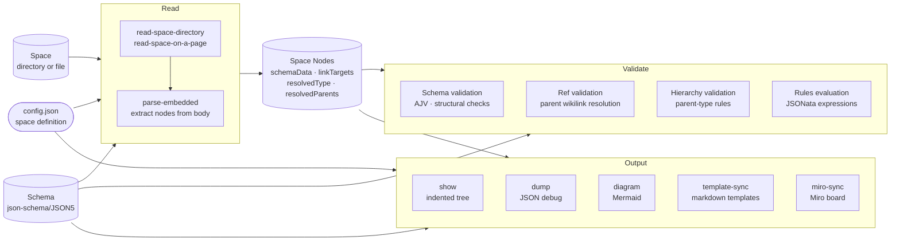
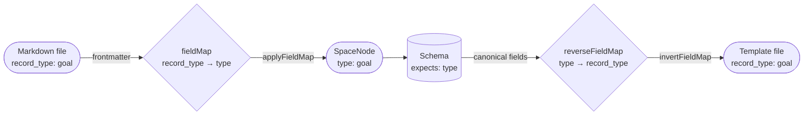

# OST Tools: Architecture

This document describes the architecture of ost-tools — how data flows through the system, and how key concepts map to code. It complements [concepts.md](concepts.md), which defines the canonical terminology.

---

## Information Flow

The following diagram shows the high-level flow from configuration and source files through to validated nodes and output commands.

**Key data concepts at each boundary:**

| Boundary | Data |
|---|---|
| Space → Read | Raw markdown files / `space_on_a_page` file |
| Read → Nodes | `SpaceNode[]` — schemaData (canonical fields), resolvedType, resolvedParents (`ResolvedParentRef[]`), linkTargets |
| Schema → Read | Hierarchy levels + relationships (type names, edge fields, direction, cardinality), type aliases |
| Schema → Validate | AJV validator, hierarchy rules, JSONata rule expressions |
| Nodes → Output | Validated node set; output commands interpret as needed |
| Config → Output | `fieldMap` (reverse) applied by template-sync for file field names |

---

## Field Remapping

Spaces may use different frontmatter field names than the canonical names expected by the schema (e.g. `record_type` instead of `type`). The `fieldMap` config option handles this transparently:

- **Read path** (`read-space-directory`, `read-space-on-a-page`, `parse-embedded`): `applyFieldMap` renames file field names to canonical names before schema validation.
- **Write path** (`template-sync`): `invertFieldMap` reverses the map so generated templates use file field names.
- The map is a **single-pass rename** — chained transitive remapping (e.g. `record_type` → `type` → `entity_type`) does not occur.

