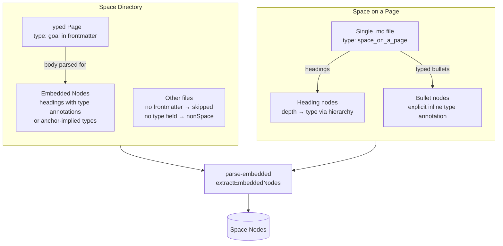

# OST Tools: Concepts and Terminology

This document is the canonical reference for concepts and terminology used in this project. It focuses on the meta-concepts the project supports, not the content of specific frameworks modelled in schemas. Before naming things in code, tests, comments, or documentation, check definitions here for consistency, and update them here when the project's "world view" changes, avoiding blurry terms as much as possible.

---

## Space

A **space** is a named collection of nodes organised according to a schema. Spaces are the primary unit of organisation — a space has a backing format (a `space directory` or a `space on a page` file) and may be registered in `config.json` with an alias for convenient access.

> The term "space" is preferred over "OST" or "tree" because the tooling is not limited to a specific framework, and future schemas may not be strictly tree-shaped.

### Space directory

A **space directory** is a directory of markdown files that backs a `space`. Each file may represent a `space node`, embed child nodes in its body, or be an unrelated file that the tooling ignores.

Each `.md` file with a `type` frontmatter field is a **typed page** — it represents one node. Its body is also scanned for **embedded nodes**:

- **Heading with `[type:: x]`** or **anchor-implied type** (e.g. `## My Goal ^goal1`) → becomes a child node.
- **Untyped headings** → update the depth stack for parent resolution but do not become nodes.
- **Typed bullet items** (`- [type:: solution] Title`) → become child nodes at any nesting depth.
- **YAML blocks** and **unbracketed `key:: value` paragraph fields** → merged into the current node's `schemaData`.

Parsing behaviour for a space directory:
- Files declaring a `space node` type via frontmatter are included as nodes.
- Such files may also contain `embedded nodes` in their body, which are extracted and included.
- Files declaring a `tooling type` (e.g. `space_on_a_page`, `dashboard`) are excluded from the node set.
- Files without frontmatter, or without a `type` field, are excluded from the node set.
- Non-markdown files are not scanned.

### Space on a page

**Space on a page** is a single-file backing format for a `space`. An entire planning tree is represented in one markdown document, using heading hierarchy, bullet point annotations, and `anchor` syntax. No separate per-node files are used. This format is most useful for the early development stages of a space, keeping information together in one file with less "boilerplate".

A file in this format carries `type: space_on_a_page` in its frontmatter. It is not itself a `space node` — it is a container.

Key properties:
- Heading hierarchy determines node depth and infers `space node` type (depth-based type inference).
- Heading levels must not skip — each level must be exactly one deeper than its parent.
- Typed bullets work the same as in typed pages.
- A horizontal rule (`---`) terminates parsing; headings below it are ignored.

#### Preamble

**Preamble** is content in a `space on a page` document that appears before the first heading. It is parsed but discarded — not associated with any node.

---

## Space node

A **space node** (or **node** for short) is a single entity in a `space` — a named, typed item defined in the schema. Nodes are the primary content of a space.

Node types are defined by the schema in use and may vary across schemas. Examples from the default schema: `vision`, `mission`, `goal`, `opportunity`, `solution`. The tooling is not prescriptive about which types exist — schemas are designed to be extended and replaced.

> `space_on_a_page` and `dashboard` are not `space node` types — they are `tooling types`.

### Embedded node

An **embedded node** is a `space node` defined *within* a containing document rather than as its own file. Embedded nodes are declared using markdown heading syntax with inline field annotations (e.g. `[type:: goal]`) or `anchor-implied types`, and are extracted at parse time.

A `typed page` may contain embedded nodes in its body. Those nodes become full members of the parsed node set, with `parent references` wired to their containing page or enclosing heading.

### Type alias

A **type alias** is an alternative name accepted in the `type` field for a given `space node` type. Aliases allow teams to use their own vocabulary while still receiving schema validation. For example, a schema might accept `outcome` as an alias for `goal`.

A `space node`'s resolved type (`resolvedType`) is its canonical type after alias resolution. Prefer resolvedType over the raw type field for all comparisons in rules and hierarchy checks.

---

## Typed page

A **typed page** is a markdown file whose frontmatter declares a `space node` type (e.g. `type: goal`). The file itself represents one node, and its body may additionally contain `embedded nodes`.

Typed pages are distinct from `space on a page` files: a typed page *is* a `space node`; a `space_on_a_page` file is merely a container.

---

## Schema

A **schema** defines the valid structure for nodes in a `space`: the fields, types, constraints, and descriptive `rules` for each entity type. A space uses the default schema unless a custom one is declared in its config.

The schema handles structural validation. It does not encode qualitative or cross-node checks — those are handled by `rules`, which may be embedded within the schema or applied separately.

Schemas are designed to be composable: shared building blocks (common field sets, scoring models, constraint overlays) can be referenced across schema files, letting teams tailor a schema without forking their foundations. *(Schema composability is under development — see [GitHub issue #17](https://github.com/mindsocket/ost-tools/issues/17).)*

### Rules

**Rules** are descriptive, and potentially executable, checks applied to nodes beyond what structural schema validation can express. Rules encode qualitative guidance and best practices alongside the schema, making them available to both tooling and agent skills.

Rules may be:
- **Descriptive** — human-readable guidance, useful as documentation and as structured input to agent skills
- **Executable** — mechanically evaluable expressions (e.g. "no more than one `active` node of a given type at a time")
- **Quantitative** — numeric thresholds or counts applied to node sets
- **Stage-based** — triggered only when a node's `status` meets a condition
- **Qualitative** — checks on content and framing (e.g. ensuring an opportunity is stated in the user's voice, not as a business goal)
- **Cross-entity** — checks spanning multiple nodes or levels of the tree
- **Coherence** — verifying that statements across related nodes credibly support one another
- **Best-practice** — guidance encoded as checks (e.g. flagging solution-framing in problem descriptions)

Rules are distinct from schema validation: the schema checks structure; rules check meaning and quality.

See [docs/rules.md](rules.md) for the rules reference, including JSONata expression syntax and the full `_metadata` field reference.

---

## Tooling types

**Tooling types** are `type` values recognised by the schema and tooling but not treated as `space nodes`. They serve organisational or display purposes:

- **`space_on_a_page`** — a container file for a `space on a page`. Not itself a node.
- **`dashboard`** — a summary view for a `space directory`. Conceptually similar to `space on a page` in that it presents a high-level, single-document view of a space — but rather than defining the space, it reflects it, querying and assembling information from the space's node files. Useful after a space has "graduated" from a single `space on a page` file to a `space directory`, as a way to preserve that top-level overview. The dashboard concept may evolve to surface more operational information over time, but there is no concrete design for that yet.

---

## Hierarchy

The **hierarchy** is the ordered list of node types in a space, from root to leaf. It is defined in the schema's `_metadata.hierarchy` array and drives depth-based type inference (for `space on a page`), tree rendering, and hierarchy validation. The root type has no parent; every other type has parents in the level immediately above (unless `allowSkipLevels` is set).

Relationships between levels are modelled as a layered DAG: a non-root node may have zero parents (orphaned), one parent, or multiple parents. The `show` command renders this as an indented tree, marking repeated nodes with `(*)` where the subtree is already shown elsewhere.

### Edge configuration

A **hierarchy edge** is a directional link connecting a child node to one or more parent nodes. Each non-root level in the hierarchy defines how its edges are expressed in frontmatter. The default is a single `parent` wikilink on the child node, but any field name, direction, and cardinality can be configured.

| Option | Default | Meaning |
|---|---|---|
| `field` | `"parent"` | The frontmatter field that holds the wikilink(s) |
| `fieldOn` | `"child"` | `"parent"` means the field is on the **parent** node and points to children (reversed direction) |
| `multiple` | `false` | When `true`, the field holds an **array** of wikilinks rather than a single one |

Dangling wikilinks — edge field values that do not resolve to any known node — are reported as reference errors during validation.

### Resolved parents

**Resolved parents** (`resolvedParents`) is the set of parent node titles derived from a node's edge field(s) at *parse* time. It is always an array (empty if unresolved or root-level). Tooling uses `resolvedParents` for tree rendering, hierarchy validation, rule evaluation, and diagram/Miro sync.

### Wikilink

A **wikilink** is the `[[Title]]` linking syntax (compatible with Obsidian) used to express hierarchy edges between `space nodes`. Any edge field — whether named `parent` or a custom name — holds wikilinks to linked nodes.

Two forms are supported:

| Form | Example | Resolves to |
|---|---|---|
| Plain title | `[[My Goal]]` | The `space node` whose title equals `My Goal` |
| Anchor ref | `[[vision_page#^goal1]]` | The `embedded node` with `anchor` `goal1` inside `vision_page.md` |

### Anchor

An **anchor** is a block anchor (e.g. `^goal1`) appended to a heading in a `typed page`, using Obsidian block anchor syntax. Anchors serve two purposes:

1. **Cross-file references** — other files can reference an `embedded node` by `[[filename#^anchor]]`.
2. **Anchor-implied type** — if the anchor name matches a node type name or a node type name followed by digits (e.g. `^mission`, `^goal1`), the node's type is inferred from the anchor, making an explicit inline annotation unnecessary.

---

## Status

**Status** is a lifecycle field on nodes indicating a node's current stage. The valid values and their semantics are defined by the schema in use. Examples from the default schema (in rough progression):

`identified` → `wondering` → `exploring` → `active` → `paused` → `completed` → `archived`

Status is required on all node types at _validation_ time. Note however that currently the `space on a page` parser chooses to apply a default.
