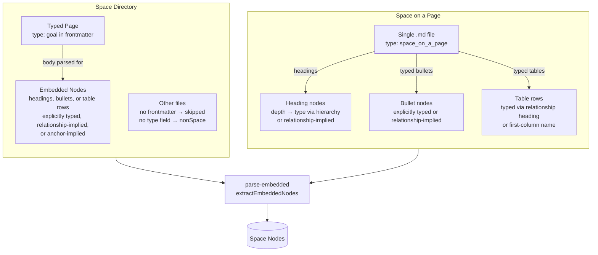

# OST Tools: Concepts and Terminology

This document is the canonical reference for concepts and terminology used in this project. It focuses on the meta-concepts the project supports, not the content of specific frameworks modelled in schemas. Before naming things in code, tests, comments, or documentation, check definitions here for consistency, and update them here when the project's "world view" changes, avoiding blurry terms as much as possible.

---

## Space

A **space** is a named collection of nodes organised according to a schema. Spaces are the primary unit of organisation — a space has a backing format (a `space directory` or a `space on a page` file) and may be registered in `config.json` with a name for convenient access.



> The term "space" is preferred over "OST" or "tree" because the tooling is not limited to a specific framework, and future schemas may not be strictly tree-shaped.

### Space directory

A **space directory** is a directory of markdown files that backs a `space`. Each file may represent a `space node`, embed child nodes in its body, or be an unrelated file that the tooling ignores.

Each `.md` file with a `type` frontmatter field is a **typed page** — it represents one node. Its body is also scanned for **embedded nodes**:

- **Heading with `[type:: x]`** or **anchor-implied type** (e.g. `## My Goal ^goal1`) → becomes a child node.
- **Relationship headings** (e.g. `### Assumptions`) → when matched to a relationship definition in the schema, signals that following content (list items or table rows) should be typed as that relationship's child type, without requiring explicit inline annotations.
- **Untyped headings** → update the depth stack for parent resolution but do not become nodes.
- **Typed bullet items** (`- [type:: solution] Title`) → become child nodes at any nesting depth.
- **Table rows** under a relationship heading → become child nodes of the relationship type.
- **YAML blocks** and **unbracketed `key:: value` paragraph fields** → merged into the current node's `schemaData`.

Parsing behaviour for a space directory:
- Files declaring a `space node` type via frontmatter are included as nodes.
- Such files may also contain `embedded nodes` in their body, which are extracted and included.
- Files declaring a `tooling type` (e.g. `space_on_a_page`, `dashboard`) are excluded from the node set.
- Files without frontmatter, or without a `type` field, are excluded from the node set (unless **type inference** is configured — see below).
- Non-markdown files are not scanned.

#### Type inference

When `typeInference` is configured on the markdown plugin, files without an explicit `type` field in frontmatter can have their type inferred from their folder path. Explicit `type:` in frontmatter always takes precedence.

Two modes are available:

- **`folder-name`** (default) — the leaf directory name is matched case-insensitively against the schema's known type names and alias keys. For example, a file at `concept/page.md` is inferred as type `concept`; a file at `study/page.md` is inferred as `source` if `study` is an alias for `source` in the schema. A folder name that is neither a type name nor an alias key results in no inference.

- **`folderMap`** — an explicit map from folder path (relative to space root) to a type name or alias. Replaces auto-matching entirely; only folders listed in the map are inferred. Longest-prefix matching is used when folder paths overlap. An unresolvable value (not a known type or alias) is a hard error at parse time.

### Space on a page

**Space on a page** is a single-file backing format for a `space`. An entire planning tree is represented in one markdown document, using heading hierarchy, bullet point annotations, and `anchor` syntax. No separate per-node files are used. This format is most useful for the early development stages of a space, keeping information together in one file with less "boilerplate".

A file in this format carries `type: space_on_a_page` in its frontmatter. It is not itself a `space node` — it is a container.

Key properties:
- Heading hierarchy determines node depth and infers `space node` type (depth-based type inference).
- Heading levels must not skip — each level must be exactly one deeper than its parent.
- Typed bullets work the same as in typed pages.
- A horizontal rule (`---`) terminates parsing; headings below it are ignored.

#### Preamble

**Preamble** is content in a `space on a page` document that appears before the first heading. It is parsed but discarded — not associated with any node.

---

## Space node

A **space node** (or **node** for short) is a single entity in a `space` — a named, typed item defined in the schema. Nodes are the primary content of a space.

Node types are defined by the schema in use and may vary across schemas. Examples from the default schema: `vision`, `mission`, `goal`, `opportunity`, `solution`. The tooling is not prescriptive about which types exist — schemas are designed to be extended and replaced.

> `space_on_a_page` and `dashboard` are not `space node` types — they are `tooling types`.

### Embedded node

An **embedded node** is a `space node` defined *within* a containing document rather than as its own file. Embedded nodes are declared using markdown heading syntax with inline field annotations (e.g. `[type:: goal]`) or `anchor-implied types`, and are extracted at parse time.

A `typed page` may contain embedded nodes in its body. Those nodes become full members of the parsed node set, with `parent references` wired to their containing page or enclosing heading.

### Type alias

A **type alias** is an alternative name accepted in the `type` field for a given `space node` type. Aliases allow teams to use their own vocabulary while still receiving schema validation. For example, a schema might accept `outcome` as an alias for `goal`.

A `space node`'s resolved type (`resolvedType`) is its canonical type after alias resolution. Prefer resolvedType over the raw type field for all comparisons in rules and hierarchy checks.

---

## Typed page

A **typed page** is a markdown file whose frontmatter declares a `space node` type (e.g. `type: goal`). The file itself represents one node, and its body may additionally contain `embedded nodes`.

Typed pages are distinct from `space on a page` files: a typed page *is* a `space node`; a `space_on_a_page` file is merely a container.

---

## Schema

A **schema** defines the valid structure for nodes in a `space`: the fields, types, constraints, and descriptive `rules` for each entity type. A space uses the default schema unless a custom one is declared in its config.

The schema handles structural validation. Cross-node and workflow checks are handled by executable `rules` defined in `$metadata.rules`.

Schemas are composable: structural definitions and metadata can be sourced across `$ref` graphs, then merged deterministically (root metadata applied last, single hierarchy provider, aliases merged, rules merged by `id` with explicit override semantics).

### Rules

**Rules** are descriptive, and potentially executable, checks applied to nodes beyond what structural schema validation can express. Rules encode qualitative guidance and best practices alongside the schema, making them available to both tooling and agent skills.

Rules may be:
- **Descriptive** — human-readable guidance, useful as documentation and as structured input to agent skills
- **Executable** — mechanically evaluable expressions (e.g. "no more than one `active` node of a given type at a time")
- **Quantitative** — numeric thresholds or counts applied to node sets
- **Stage-based** — triggered only when a node's `status` meets a condition
- **Qualitative** — checks on content and framing (e.g. ensuring an opportunity is stated in the user's voice, not as a business goal)
- **Cross-entity** — checks spanning multiple nodes or levels of the tree
- **Coherence** — verifying that statements across related nodes credibly support one another
- **Best-practice** — guidance encoded as checks (e.g. flagging solution-framing in problem descriptions)

Rules are distinct from schema validation: the schema checks structure; rules check meaning and quality.

See [docs/rules.md](rules.md) for the rules reference, including JSONata expression syntax and the full `$metadata` field reference.

---

## Tooling types

**Tooling types** are `type` values recognised by the schema and tooling but not treated as `space nodes`. They serve organisational or display purposes:

- **`space_on_a_page`** — a container file for a `space on a page`. Not itself a node.
- **`dashboard`** — a summary view for a `space directory`. Conceptually similar to `space on a page` in that it presents a high-level, single-document view of a space — but rather than defining the space, it reflects it, querying and assembling information from the space's node files. Useful after a space has "graduated" from a single `space on a page` file to a `space directory`, as a way to preserve that top-level overview. The dashboard concept may evolve to surface more operational information over time, but there is no concrete design for that yet.

---

## Hierarchy

The **hierarchy** is the ordered list of node types in a space, from root to leaf. It is defined in the schema's `$metadata.hierarchy.levels` array and drives depth-based type inference (for `space on a page`), tree rendering, and structural validation. The root type has no parent; every other type has parents in the level immediately above (unless `$metadata.hierarchy.allowSkipLevels` is set).

The hierarchy is modelled as a layered DAG: a non-root node may have zero parents (orphaned), one parent, or multiple parents. The `show` command renders this as an indented tree, marking repeated nodes with `(*)` where the subtree is already shown elsewhere.

Each non-root level uses the shared `field`, `fieldOn`, and `multiple` edge options (see [Graph edges](#graph-edges)). Hierarchy-specific options:

| Option | Default | Meaning |
|---|---|---|
| `selfRef` | `false` | When `true`, a node may have a parent of the same resolved type, using `field` for both regular and same-type parents |
| `selfRefField` | _undefined_ | When set, specifies a separate field for same-type parent relationships (always on the child). Requires `selfRef: true`. |
| `templateFormat` | _undefined_ | Embedding hint (`"list"`, `"table"`, `"heading"`). When set alongside `matchers`, enables hierarchy embedding in typed pages |
| `matchers` | _undefined_ | Heading patterns (strings or `/regex/`) that signal this level's embedding section |
| `embeddedTemplateFields` | _undefined_ | Column names used when `template-sync` generates table stubs for this level |

### Hierarchy embedding

Hierarchy levels with `templateFormat` and `matchers` support **embedded parsing** analogous to relationships: a heading in a typed page that matches the level's `matchers` signals that following content (list items or table rows) belongs to that type, without requiring explicit `[type:: x]` annotations.

Two sub-patterns:

- **Child-level embedding** — heading matches the next level in hierarchy → items create new child nodes.
- **Parent-level referencing** — heading matches the level *above* the current node's type → bare wikilink items (`- [[X]]`) populate the current node's field pointing up to that parent type. This lets a node list its parent references inline without creating duplicate nodes.

Bare wikilink items (`- [[X]]`) in any embedding section always populate a field rather than creating new nodes.

**Example: Activities listing Capabilities with sub-capabilities**

```json
"levels": [
  "Activities",
  {
    "type": "Capabilities",
    "field": "capabilities",
    "fieldOn": "parent",
    "multiple": true,
    "selfRefField": "parent"
  }
]
```

This defines two edge types for Capabilities:
- **Activities → Capabilities**: Via `capabilities` array field on Activity nodes
- **Capability → Capability**: Via `parent` field on Capability nodes (same-type, child-side)

---

## Relationships

A **relationship** is a link between a parent type and a child type that is not part of the primary structural hierarchy. For example, an `opportunity` might have a relationship with `assumption` (multiple) or `problem_statement` (single).

Relationships are defined in `$metadata.relationships`. Like hierarchy levels, they use the shared `field`, `fieldOn`, and `multiple` edge options (see [Graph edges](#graph-edges)), but carry additional metadata used for parsing and template generation:

- **`parent`** / **`type`** — the parent and child canonical types (required)
- **`templateFormat`** — parsing/generation hint: `"heading"`, `"list"`, `"table"`, or `"page"`
- **`matchers`** — heading text patterns (strings or `/regex/`) used to detect relationship sections during embedded parsing

A heading in a typed page that matches a relationship's `matchers` signals to the parser that following content (single nodes, list items, or table rows) should be typed as that relationship's child type — without requiring explicit inline `[type:: x]` annotations.

---

## Graph edges

Both `hierarchy.levels` and `relationships` define **edges** in a directed graph over the node set. All edges use the same three configuration options:

| Option | Default | Meaning |
|---|---|---|
| `field` | `"parent"` | The frontmatter field holding the wikilink(s) |
| `fieldOn` | `"child"` | `"parent"` means the field is on the **parent** node and points to children (reversed direction) |
| `multiple` | `false` | When `true`, the field holds an **array** of wikilinks rather than a single one |

The `fieldOn: "parent"` pattern is used when the content model lists children on the parent node (e.g. `tasks: ["[[Task A]]", "[[Task B]]"]`). Embedded parsing then appends child wikilinks to the parent's field array rather than setting a `parent` field on each child.

Dangling wikilinks — edge field values that do not resolve to any known node — are reported as reference errors during validation.

### Wikilink

A **wikilink** is the `[[Title]]` linking syntax (compatible with Obsidian) used in edge fields to reference other `space nodes`. Two forms are supported:

| Form | Example | Resolves to |
|---|---|---|
| Plain title | `[[My Goal]]` | The `space node` whose title equals `My Goal` |
| Anchor ref | `[[vision_page#^goal1]]` | The `embedded node` with `anchor` `goal1` inside `vision_page.md` |

### Resolved parents

**Resolved parents** (`resolvedParents`) is the set of parent references derived from a node's edge fields at *parse* time. It is always an array (empty if unresolved or root-level). Both `hierarchy.levels` and `relationships` edges resolve into this single array — forming a unified labelled directed graph over the node set.

Each entry is a `ResolvedParentRef` object:

| Field | Type | Description |
|---|---|---|
| `title` | `string` | The parent node's title |
| `field` | `string` | The frontmatter field that held the wikilink |
| `source` | `'hierarchy' \| 'relationship'` | Whether the edge came from a hierarchy level or a relationship |
| `selfRef` | `boolean` | Whether the edge is a same-type (self-referential) parent link |

The `source` label lets downstream consumers distinguish edge types without re-inspecting the schema. Validation routes `hierarchy` edges to structural checks (parent-type rules, skip-level detection) and `relationship` edges to field reference checks (type-match, missing-target). Tree rendering and rule evaluation use the full set.

### Anchor

An **anchor** is a block anchor (e.g. `^goal1`) appended to a heading in a `typed page`, using Obsidian block anchor syntax. Anchors serve two purposes:

1. **Cross-file references** — other files can reference an `embedded node` by `[[filename#^anchor]]`.
2. **Anchor-implied type** — if the anchor name matches a node type name or a node type name followed by digits (e.g. `^mission`, `^goal1`), the node's type is inferred from the anchor, making an explicit inline annotation unnecessary.

---

## Filter expressions

A **filter expression** is a string that selects a subset of nodes from a space. Filter expressions are used with the `--filter` flag on the `show` command and in named filter views in config.

### Syntax

```
WHERE {jsonata}                    — return nodes where the JSONata predicate is truthy
SELECT {spec} WHERE {jsonata}      — filter by WHERE, then expand result via SELECT
SELECT {spec}                      — expand from all nodes (no WHERE filter)
{jsonata}                          — bare JSONata, treated as a WHERE predicate (convenience shorthand)
```

Keywords (`WHERE`, `SELECT`) are case-insensitive.

### Predicate context

The WHERE predicate is a [JSONata](https://docs.jsonata.org/overview) expression evaluated per node. Node fields (from `schemaData`) are accessible directly — e.g. `resolvedType`, `status`, `title`. Additionally, two pre-computed traversal arrays are available:

| Field | Description |
|-------|-------------|
| `ancestors[]` | Flat array of ancestor nodes, nearest first, deduplicated by title |
| `descendants[]` | Flat array of descendant nodes, nearest first, deduplicated by title |

Each entry in `ancestors[]` or `descendants[]` includes all schema fields of the target node, plus edge metadata:

| Metadata field | Type | Description |
|----------------|------|-------------|
| `_field` | `string` | The edge field name that connects to this ancestor/descendant |
| `_source` | `'hierarchy' \| 'relationship'` | Whether the edge came from the hierarchy or a relationship |
| `_selfRef` | `boolean` | Whether the edge is a same-type (self-referential) link |

### SELECT spec

The SELECT clause expands the result set by walking the graph from matched nodes. The spec is a comma-separated list of directives:

| Directive | Meaning |
|-----------|---------|
| `ancestors` | All ancestor nodes |
| `ancestors(type)` | Ancestors of the given resolved type |
| `descendants` | All descendant nodes |
| `descendants(type)` | Descendants of the given resolved type |
| `siblings` | Nodes sharing at least one parent with matched nodes |
| `relationships` | Nodes connected via a relationship (non-hierarchy) edge |
| `relationships(childType)` | Relationship-connected nodes of the given child type |
| `relationships(parentType:childType)` | As above, also filtering by parent type |
| `relationships(parentType:field:childType)` | Fully qualified: also filtering by edge field name |

Multiple directives may be combined with commas: `SELECT ancestors(goal), siblings WHERE ...`

### Examples

```jsonata
WHERE resolvedType='solution' and status='active'

WHERE resolvedType='solution' and $exists(ancestors[resolvedType='opportunity' and status='active'])

WHERE $count(descendants[resolvedType='solution']) > 3

SELECT ancestors(opportunity) WHERE resolvedType='solution'

SELECT siblings WHERE resolvedType='solution' and status='active'

SELECT relationships(assumption) WHERE resolvedType='opportunity'
```

---

## Filter views

A **filter view** is a named filter expression defined in the space config. Views allow commonly used filters to be referenced by name rather than repeating the expression inline.

Views are defined in the space config under the `views` key:

```json
{
  "spaces": [
    {
      "name": "my-space",
      "path": "/path/to/space",
      "views": {
        "active-solutions": {
          "expression": "WHERE resolvedType='solution' and status='active'"
        }
      }
    }
  ]
}
```

Use a view by name with `ost-tools show <space> --filter <view-name>`. If no matching view name is found in the config, the value is treated as an inline filter expression.

---

## Status

**Status** is a lifecycle field on nodes indicating a node's current stage. The valid values and their semantics are defined by the schema in use. Examples from the default schema (in rough progression):

`identified` → `wondering` → `exploring` → `active` → `paused` → `completed` → `archived`

Status is required on all node types at _validation_ time. Note however that currently the `space on a page` parser chooses to apply a default.


---

## Plugin

A **plugin** is a module that extends the tool's capabilities.

Plugins that support parsing produce raw `SpaceNode[]` results given a suitable configuration. Graph edge resolution (`resolveGraphEdges`) is called by the core afterwards.

The `plugins` field in config is a **map** from plugin name to plugin config object. All plugin names must start with `ost-tools-`, but the prefix is optional in config and normalised on load. Built-in plugins take precedence and all are loaded by default. External plugin names specified in config are then resolved in order:

1. Config-adjacent: `{configDir}/plugins/{ost-tools-name}`
2. npm: a package matching `ost-tools-*`

Each plugin declares a `configSchema` JSON Schema; the loader validates the config block against it before invoking the plugin. Config fields annotated with `format: 'path'` are resolved relative to `configDir` by the loader.

### Dispatch contract

Plugins are called in order (external plugins first, then built-ins). For each operation:
- A plugin that does not implement the hook is skipped.
- A plugin that implements the hook returns `T | null`: non-null means "I handled it"; null means "not me, try the next plugin."
- The first non-null result wins. If no plugin handles the operation, the command throws an error.

A plugin that can handle a space should do so and return a result. Conversely, a plugin should return null if it inspects the context and determines the operation is not meant for it (for example, a plugin that only handles a specific file format or URL).
